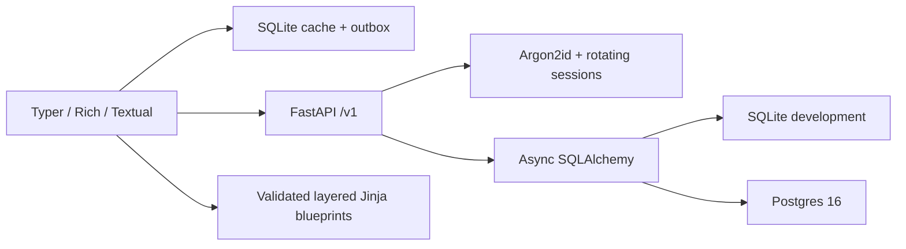

# Flunky

Developer tasks and project scaffolding, from your terminal.


Flunky combines a Typer/Rich CLI, an optional Textual task board, and a FastAPI backend. It supports ten project stacks, safe additive project generation, offline task edits, and revocable login sessions. This checkout is locally verified on Apple Silicon; hosted Windows/Linux CI and public distribution are still release gates. See [launch readiness](docs/LAUNCH_READINESS.md).

## Install in 30 seconds

From this checkout, with Python 3.10+ and uv installed:

```sh
uv tool install .
flunky --help
flunky init my-app --stack fastapi --yes
```

Alternatively, `pipx install .` creates an isolated installation. After the maintainer publishes and verifies the PyPI release, use `uv tool install flunky` or `pipx install flunky`. The availability and ownership of that public package name have not been verified by this checkout. Do not assume a package with the same name is this release.

## Tasks

Start the local backend from this checkout:

```sh
uv sync --extra dev --extra test
uv run alembic upgrade head
uv run uvicorn backend.main:app
```

In another terminal:

```sh
flunky register
flunky login
flunky add "Fix login bug" -p high -d tomorrow -t backend
flunky today
flunky list --json
flunky done 1
flunky undo
flunky tui
flunky sync
```

`login` uses browser device approval. Scripts can use `login --with-password --username NAME --password-stdin`. Access tokens expire; refresh tokens rotate, and logout revokes server sessions. Credentials use the OS keychain, with a warned, restricted-file fallback. Offline edits are queued and replayed in order when you run `sync`.

Every command supports global `--json`, `--quiet`, `--yes`, `--no-color`, and `--debug`. Piped/CI execution does not prompt. See the [generated command reference](docs/COMMANDS.md), [backend and migrations](docs/BACKEND.md), and [project blueprints](docs/BLUEPRINTS.md).

## Project generation

```sh
flunky init my-app --stack fastapi --type fullstack --addons docker,ci --license MIT --yes
flunky init preview --stack nextjs --dry-run
flunky structure apply existing-project --dry-run
flunky structure apply existing-project --yes
```

Stacks: Python, Python CLI, FastAPI, data science, Next.js, MERN, NestJS, Electron, Expo/React Native, and Flutter. Layouts: app, fullstack, monorepo, library, CLI. Base files include docs, policies, tests, checks, CI, pre-commit and devcontainer configuration. Generation preserves existing files; installation, Git initialization and opening an editor are explicit options. Review generated projects before deployment: auth integration, native packaging/signing, and library publication require additional work.

## Terminal setup

Use a UTF-8 terminal and a monospace font you find readable; no icon font is required. Flunky uses ASCII fallbacks where Unicode is unavailable and respects `NO_COLOR`. `flunky config set theme high-contrast` enables the high-contrast theme. Install completion with `flunky completion install zsh` (also bash, fish, PowerShell/pwsh). The command prints shell setup instructions instead of editing your profile.

Locally exercised: macOS zsh, a VHS/ttyd PTY, and non-TTY subprocess output. Terminal.app, iTerm2, Warp, VS Code terminal, Windows Terminal, PowerShell and cmd remain a manual visual compatibility checklist, not a claim of completed testing. `flunky doctor` reports runtime, backend, credential-storage and terminal diagnostics.

## Architecture



The backend uses Alembic migrations, structured request logs, pagination/filtering, task soft deletion, and session/PAT revocation. Docker runs as a non-root user. The M2 arm64 image measured 104,965,602 bytes; the final build measurement is recorded in the launch report. Production email delivery and a shared multi-worker rate-limit adapter still need deployment-specific implementation. There is no billing or AI agent; only a hidden provider extension contract exists.

## Develop and verify

```sh
uv sync --extra dev --extra test --extra docs
uv run ruff check cli backend tests scripts
uv run ruff format --check cli backend tests scripts
uv run mypy
uv run python -m pytest --cov --cov-fail-under=90
uv run python -m scripts.verify_live
uv run python -m scripts.verify_blueprints
uv run python -m scripts.generate_docs
uv run mkdocs build --strict
uv build
```

[Contributing](CONTRIBUTING.md) · [Security](SECURITY.md) · [Verification evidence](docs/VERIFICATION.md) · [Release procedure](docs/RELEASING.md) · [MIT license](LICENSE)
