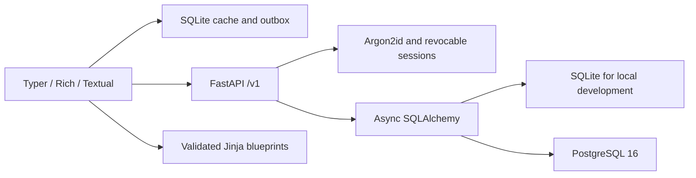

# Flunky

Manage developer tasks and generate project structures from your terminal.

Flunky provides a Typer/Rich CLI, an optional Textual task board, a FastAPI backend, and templates for ten project stacks. Project generation works locally; task management connects to the API and supports cached reads and queued offline changes.

**Start here:** [Complete TXT guide](docs/USER_GUIDE.txt) · [Command reference](docs/COMMANDS.md) · [Launch readiness](docs/LAUNCH_READINESS.md)


## Install from this checkout

Requirements: Python 3.10–3.13 and [uv](https://docs.astral.sh/uv/). Run these commands from the repository root:

```sh
uv sync --locked --extra dev --extra test
uv tool install .
flunky --version
flunky --help
```

If Flunky is already installed, update it from this checkout with `uv tool install --force .`. If your shell cannot find `flunky`, run `uv tool update-shell` and open a new terminal. `pipx install .` is an alternative isolated installation method.

Public PyPI publication has not been verified as this release. Install from this checkout until the release is published and its identity confirmed.

## Generate a project

No backend or account is needed:

```sh
flunky init my-app --stack fastapi --yes
flunky init fullstack-app --stack fastapi --type fullstack --addons docker,ci --yes
flunky init preview-app --stack nextjs --dry-run
flunky structure apply existing-project --dry-run
```

Run `flunky init` without arguments for the wizard. The generator adds standard documentation, policies, checks, CI configuration and stack-specific source files. Existing files are preserved. Dependency installation, Git initialization and opening VS Code are opt-in through `--install`, `--git` and `--open`.

| Stacks | Layouts |
| --- | --- |
| Python, Python CLI, FastAPI, data science | `app`, `fullstack`, `monorepo`, `library`, `cli` |
| Next.js, MERN, NestJS, Electron | Same layout options |
| Expo / React Native, Flutter | Same layout options; native setup is separate |

Add-ons: `docker`, `ci`, `database`, `auth`, `linting`, `docs-site`, `testing`, `monorepo`. Tests, linting and CI are included in the baseline. The auth add-on provides integration guidance; it does not enable authentication. See [blueprints](docs/BLUEPRINTS.md) for exact behavior and custom templates.

## Run the task backend

On the Mac configured for this checkout, the backend now runs automatically as a LaunchAgent. Open a new terminal and run `flunky doctor`; no server terminal is needed. See [the installed Mac setup guide](docs/MAC_SETUP.txt) for its data location, logs and service controls. This is local hosting and requires the Mac to be awake and the user logged in.

For a fresh setup on another machine:

Keep the backend running in one terminal. The following macOS/Linux example uses a separate demo database, preserving an existing `flunky.db`:

```sh
export DATABASE_URL="sqlite+aiosqlite:///./flunky-demo.db"
uv run alembic upgrade head
uv run uvicorn backend.main:app --host 127.0.0.1 --port 8000
```

In PowerShell, set the variable with `$env:DATABASE_URL = 'sqlite+aiosqlite:///./flunky-demo.db'`, then run the same migration/server commands. Start from the repository root and use the same database setting on subsequent runs. Read the [migration instructions](docs/BACKEND.md) before upgrading a legacy database.

API reference: [localhost:8000/docs](http://localhost:8000/docs). Health and readiness: `/health` and `/ready`.

In a second terminal:

```sh
flunky config profile local
flunky config set api_url http://localhost:8000
flunky doctor
flunky register
flunky login
flunky add "Fix login bug" -p high -d tomorrow -t backend
flunky list
```

`login` opens browser approval. Use `flunky login --with-password --username NAME` for an interactive password login; scripts can add `--password-stdin` and supply the password through stdin.

Registration usernames must be 3–50 letters, numbers, underscores or hyphens, with no spaces. Passwords must be 8–1024 characters. Invalid input is explained before the CLI sends the registration request.

The Compose alternative runs PostgreSQL 16, migrations and the API. Configure `SECRET_KEY` and `POSTGRES_PASSWORD`, then run `docker compose up --build`. See the [TXT guide](docs/USER_GUIDE.txt) for setup and persistent-volume considerations.

## Everyday commands

Use the ID returned by `add` or `list` in place of `1`:

```sh
flunky                          # Auth status and task dashboard
flunky today
flunky upcoming
flunky list --completed false --sort due_date
flunky show 1
flunky edit 1 --title "Fix login redirect" --priority high
flunky done 1
flunky undo
flunky rm 1 --yes
flunky sync                      # Replay queued offline changes
flunky tui                       # Full-screen board
flunky logout
```

The TUI supports arrow keys, `/` for search, Escape to return to the task list, `d` to complete, `u` to undo, and `q` to quit. Offline-created tasks use negative IDs: for example, `flunky show -- -1`.

Global flags: `--json`, `--quiet`, `--yes`, `--no-color`, `--debug`. Use `COMMAND --help` for options. Piped/CI execution does not prompt. Legacy `task` commands and `init create STACK NAME` remain available; the full command reference includes them.

## Repository layout

```text
Flunky/
├── cli/                         CLI commands, API client and offline storage
│   ├── ui/                      Shared terminal output and prompts
│   ├── blueprints/              Project-generation command flows
│   ├── services/                Scaffold engine and project registry
│   ├── templates/               Bundled, versioned template layers
│   │   ├── _base/               Standards shared by generated projects
│   │   └── <stack>/             manifest.json and named *.j2 source files
│   └── ai/                      Reserved provider interface; no agent
├── backend/                     FastAPI application and database models
│   ├── core/                    Configuration, security, mail and logging
│   ├── routers/                 HTTP endpoints
│   ├── services/                Application behavior
│   ├── repositories/            Database queries
│   └── schemas/                 Request and response validation
├── migrations/                  Alembic revisions
├── tests/                       Backend, CLI, security and generator tests
├── scripts/                     Build, docs generation and verification tools
├── packaging/                   Standalone executable launcher
├── docs/                        User guide, operations and release documentation
│   ├── USER_GUIDE.txt           Complete setup and command guide
│   ├── demos/                   CLI GIF and VHS recording source
│   ├── history/                 Archived reports and old tree snapshot
│   ├── performance/             Startup measurement evidence
│   └── verification/            CLI logs and dependency audit evidence
├── .github/                     CI, documentation, security and release workflows
├── my-ml-project/               Existing user-generated example, preserved
├── pyproject.toml               Package metadata, dependencies and tool settings
├── uv.lock                      Resolved Python dependencies
├── alembic.ini                  Migration configuration
├── compose.yaml                PostgreSQL and API services
├── Dockerfile                   Non-root backend image
└── mkdocs.yml                   Documentation-site configuration
```

Template filenames mirror the files they generate: for example, `cli/templates/fastapi/src/__package_name__/api.py.j2`. Each manifest maps its source files to rendered destinations. Maintain the assets through `scripts/build_template_assets.py`; regeneration preserves the layout.

Local environments, databases, secrets, editor settings, caches, logs and build products are ignored by Git. `.venv/` is the uv development environment. `build/`, `dist/` and `site/` are generated as needed rather than maintained as source. Existing local environments and personal project data are preserved during repository cleanup.

## Architecture



Authentication supports rotating refresh tokens, server-side logout and personal access tokens. Credentials prefer the OS keychain, with a warned file fallback. Task storage supports filtering, pagination and soft deletion. Database changes use Alembic migrations.

## Terminal setup

Use a UTF-8 terminal; no special icon font is required. Flunky respects `NO_COLOR` and supports ASCII fallbacks. Set a theme with `flunky config set theme high-contrast` (also `auto`, `dark`, `light`).

Install completion with `flunky completion install zsh`, or choose `bash`, `fish`, `powershell` or `pwsh`. This writes a dedicated completion file and prints activation instructions without changing shell startup files. See the [TXT guide](docs/USER_GUIDE.txt) for shell-specific activation.

## Develop and verify

```sh
uv sync --locked --extra dev --extra test --extra docs
uv run ruff check cli backend tests scripts packaging
uv run ruff format --check cli backend tests scripts packaging
uv run mypy
uv run python -m pytest --cov --cov-fail-under=90
uv run python -m scripts.verify_live
uv run python -m scripts.verify_blueprints
uv run python -m scripts.generate_docs
uv run mkdocs build --strict
uv build
```

The exhaustive blueprint check generates 12,800 combinations. Installed-wheel command verification is available through `scripts/verify_cli_surface.py --cli PATH_TO_FLUNKY`. Run Python scripts as modules from the repository root, for example `uv run python -m scripts.verify_cli_surface --cli .install-check/bin/flunky` after creating that test installation.

## Status and release gates

Recorded M7 verification: 625 tests passed on macOS Python 3.10–3.13, 92.50% coverage, 109 real installed-CLI invocations, and 14.4 ms mean warm help startup on Apple M3. PostgreSQL/Docker and a local arm64 standalone build were also exercised. See [verification evidence](docs/VERIFICATION.md) for the scope of each run and subsequent cleanup checks.

Public launch still needs hosted Windows/Linux/Intel CLI validation, publishing and signing setup, production email/shared rate-limit adapters, and resolution of the generated Expo dependency advisories. Native packaging and some library-specific work remain project responsibilities. There is no billing or AI agent. The [launch report](docs/LAUNCH_READINESS.md) documents the limitations rather than claiming those gates have passed.

[Contributing](CONTRIBUTING.md) · [Security](SECURITY.md) · [Release procedure](docs/RELEASING.md) · [MIT license](LICENSE)
